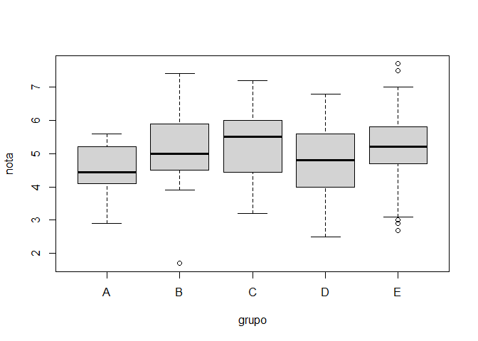
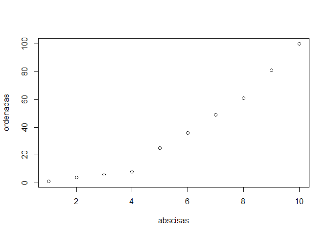
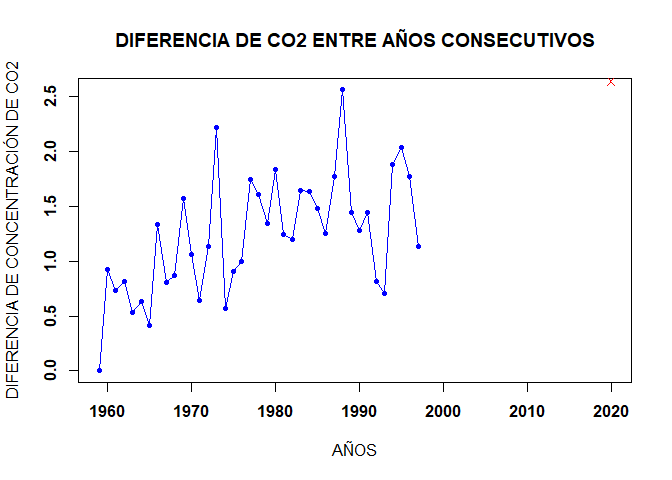

# **TAREA 1**

Integrantes\*\* - BARRRENECHEA BENITES, Marycielo Corazon - BECERRA
ZEVALLOS, Cesar Gerardo - MUÑOZ RIMACHI, Camilo Patricio

## **PARTE 1**

**1.** Calcula los valores numéricos aproximados de

**a.**

    (0.3 * 0.15) / (0.3 * 0.15 + 0.2 * 0.8 + 0.5 * 0.12)

    ## [1] 0.1698113

**b.**

    ((5 ^ 6 )/(factorial(6)) ) *exp(-5)

    ## [1] 0.1462228

**c.**

    (factorial(20)/(factorial(13)*factorial(7)))*0.4^7*0.6^13

    ## [1] 0.1658823

**2.** Realizar la siguiente suma

**a.** 1+2+3+…+1000

    sum(seq(1:1000))

    ## [1] 500500

**b.** 1+2+4+8+16+…+1024

    1+sum(2^seq(1:10))

    ## [1] 2047

**3.** El vector grupo representa el grupo al que pertenece una serie de
alumnos.

**a.** ¿Cuántos elementos tiene?

    load("ei1012-1516-la-s1-datos.RData")
    length(grupo)

    ## [1] 192

**b.** ¿En qué posiciones del vector está la letra “A’’?

    which(grupo=="A")

    ##  [1]   2   8  17  21  28  84 101 108 111 115 123 136 190 192

**4.** El vector nota representa la nota de un examen de los alumnos que
están en los grupos del vector grupo.

**a.** ¿Cuánto suman todas las notas?

    sum(nota)

    ## [1] 962

**b.** ¿Cuál es la media aritmética de todas las notas?

    mean(nota)

    ## [1] 5.010417

**c.** ¿En qué posiciones están las notas mayores de 7.0?

    which(nota>7)

    ## [1]  81 103 120 151

**d.** Visualiza las notas ordenadas de mayor a menor

    notasordenadas<-order(nota,na.last=TRUE,decreasing=TRUE)
    nota[notasordenadas]

    ##   [1] 7.7 7.5 7.4 7.2 7.0 6.9 6.9 6.8 6.8 6.8 6.8 6.8 6.6 6.5 6.4 6.4 6.4 6.4
    ##  [19] 6.3 6.2 6.2 6.2 6.2 6.2 6.2 6.1 6.1 6.1 6.1 6.0 6.0 6.0 6.0 6.0 6.0 5.9
    ##  [37] 5.9 5.9 5.9 5.9 5.9 5.9 5.9 5.9 5.8 5.8 5.8 5.8 5.8 5.7 5.7 5.7 5.7 5.7
    ##  [55] 5.6 5.6 5.6 5.6 5.6 5.6 5.5 5.5 5.5 5.5 5.5 5.5 5.5 5.5 5.5 5.5 5.5 5.5
    ##  [73] 5.5 5.4 5.4 5.4 5.4 5.4 5.4 5.4 5.4 5.3 5.3 5.3 5.3 5.2 5.2 5.2 5.2 5.2
    ##  [91] 5.2 5.2 5.1 5.0 5.0 5.0 5.0 5.0 5.0 5.0 5.0 5.0 4.9 4.9 4.9 4.9 4.9 4.9
    ## [109] 4.8 4.8 4.8 4.8 4.8 4.8 4.7 4.7 4.7 4.7 4.7 4.7 4.7 4.7 4.7 4.7 4.6 4.6
    ## [127] 4.6 4.6 4.5 4.5 4.5 4.5 4.5 4.5 4.4 4.4 4.4 4.4 4.4 4.4 4.4 4.3 4.3 4.3
    ## [145] 4.2 4.2 4.2 4.2 4.2 4.2 4.2 4.2 4.1 4.1 4.1 4.1 4.1 4.0 4.0 4.0 4.0 4.0
    ## [163] 4.0 3.9 3.9 3.8 3.8 3.8 3.7 3.7 3.7 3.7 3.6 3.6 3.6 3.5 3.4 3.4 3.4 3.4
    ## [181] 3.2 3.2 3.2 3.1 3.0 2.9 2.9 2.9 2.7 2.6 2.5 1.7

OTRA MANERA:

    rev(sort(nota))

    ##   [1] 7.7 7.5 7.4 7.2 7.0 6.9 6.9 6.8 6.8 6.8 6.8 6.8 6.6 6.5 6.4 6.4 6.4 6.4
    ##  [19] 6.3 6.2 6.2 6.2 6.2 6.2 6.2 6.1 6.1 6.1 6.1 6.0 6.0 6.0 6.0 6.0 6.0 5.9
    ##  [37] 5.9 5.9 5.9 5.9 5.9 5.9 5.9 5.9 5.8 5.8 5.8 5.8 5.8 5.7 5.7 5.7 5.7 5.7
    ##  [55] 5.6 5.6 5.6 5.6 5.6 5.6 5.5 5.5 5.5 5.5 5.5 5.5 5.5 5.5 5.5 5.5 5.5 5.5
    ##  [73] 5.5 5.4 5.4 5.4 5.4 5.4 5.4 5.4 5.4 5.3 5.3 5.3 5.3 5.2 5.2 5.2 5.2 5.2
    ##  [91] 5.2 5.2 5.1 5.0 5.0 5.0 5.0 5.0 5.0 5.0 5.0 5.0 4.9 4.9 4.9 4.9 4.9 4.9
    ## [109] 4.8 4.8 4.8 4.8 4.8 4.8 4.7 4.7 4.7 4.7 4.7 4.7 4.7 4.7 4.7 4.7 4.6 4.6
    ## [127] 4.6 4.6 4.5 4.5 4.5 4.5 4.5 4.5 4.4 4.4 4.4 4.4 4.4 4.4 4.4 4.3 4.3 4.3
    ## [145] 4.2 4.2 4.2 4.2 4.2 4.2 4.2 4.2 4.1 4.1 4.1 4.1 4.1 4.0 4.0 4.0 4.0 4.0
    ## [163] 4.0 3.9 3.9 3.8 3.8 3.8 3.7 3.7 3.7 3.7 3.6 3.6 3.6 3.5 3.4 3.4 3.4 3.4
    ## [181] 3.2 3.2 3.2 3.1 3.0 2.9 2.9 2.9 2.7 2.6 2.5 1.7

**e.** ¿En qué posición está la nota máxima?

    match(max(nota),nota)

    ## [1] 120

    head(notasordenadas,1)

    ## [1] 120

**5.** A partir de los vectores grupo y nota definidos.

    data.al=data.frame(grupo=c(grupo),nota=c(nota))

**a.** Suma de notas 10 primeros alumnos

    sum(nota[1:10])

    ## [1] 51.8

**b.** ¿Cuántos alumnos hay en el grupo C?

    length(nota[grupo=='C'])

    ## [1] 39

**c.** ¿Cuántos alumnos han aprobado?

    length(nota[nota>5])

    ## [1] 93

**d.** ¿Cuántos alumnos del grupo B han aprobado?

    length(nota[grupo=='B'&nota>5])

    ## [1] 10

**e.** Porcentaje de alumnos del grupo C han aprobado

    length(nota[grupo=='C'&nota>5])/length(nota[grupo=='C'])*100

    ## [1] 56.41026

**f.** ¿De qué grupos son la máxima y mínima notas de toda la muestra?

MÁXIMA:

    max(nota)

    ## [1] 7.7

    data.al[data.al$nota==max(nota),]

    ##     grupo nota
    ## 120     E  7.7

MÍNIMA:

    min(nota)

    ## [1] 1.7

    data.al[data.al$nota==min(nota),]

    ##     grupo nota
    ## 142     B  1.7

**g.** Nota media de los alumnos de grupo A y B, juntos, considerando
sólo a los que han aprobado

    mean(c(nota[grupo=='B'&nota>5],nota[grupo=='A'&nota>5]))

    ## [1] 5.942857

**6.** Calcula el percentil 66 de las notas de todos los alumnos, y
también de los alumnos del grupo C

    quantile(nota[notasordenadas],66/100)

    ## 66% 
    ## 5.5

PARA LOS ALUMNOS DEL GRUPO C:

    soloC <- data.al[(data.al$grupo == "C"),]
    quantile(soloC$nota, 66/100)

    ##   66% 
    ## 5.808

**7.** Un alumno tiene una nota de 4.9. ¿Qué porcentaje, del total de
alumnos, tiene una nota menor o igual que la suya? ¿Y qué porcentaje
tiene una nota mayor o igual que la suya?

MENOR:

    length(nota[nota<=4.9])/length(nota)*100

    ## [1] 46.875

MAYOR:

    length(nota[nota>=4.9])/length(nota)*100

    ## [1] 56.25

**8.** Realiza el gráfico de diagramas de caja de las notas de cada
grupo, para poder comparar el nivel de cada uno de ellos.

    boxplot(nota~grupo)

**9.** Si la variable conc recoge la concentración de plomo (en ppm) en
el aire de cierta zona durante un día completo

    horas<-c(rep(0,12),gl(23,12))
    minutos<-c(0,seq(5,55,5))
    plomo<-data.frame(conc, horas,minutos)
    plomo

    ##      conc horas minutos
    ## 1    4.76     0       0
    ## 2    4.60     0       5
    ## 3    6.14     0      10
    ## 4    2.96     0      15
    ## 5    3.15     0      20
    ## 6    1.77     0      25
    ## 7    4.36     0      30
    ## 8    4.00     0      35
    ## 9    2.03     0      40
    ## 10   6.13     0      45
    ## 11   2.88     0      50
    ## 12   6.15     0      55
    ## 13   3.05     1       0
    ## 14   3.37     1       5
    ## 15   5.21     1      10
    ## 16   3.10     1      15
    ## 17   3.57     1      20
    ## 18   7.11     1      25
    ## 19   7.32     1      30
    ## 20   2.75     1      35
    ## 21   6.96     1      40
    ## 22   7.66     1      45
    ## 23   3.54     1      50
    ## 24   6.48     1      55
    ## 25   6.19     2       0
    ## 26   7.77     2       5
    ## 27   8.96     2      10
    ## 28   6.94     2      15
    ## 29   5.70     2      20
    ## 30   7.14     2      25
    ## 31   8.38     2      30
    ## 32   5.69     2      35
    ## 33   7.24     2      40
    ## 34  10.57     2      45
    ## 35   9.99     2      50
    ## 36   9.83     2      55
    ## 37   9.06     3       0
    ## 38  11.28     3       5
    ## 39   7.07     3      10
    ## 40  11.09     3      15
    ## 41  11.20     3      20
    ## 42  10.73     3      25
    ## 43  12.24     3      30
    ## 44  13.14     3      35
    ## 45  14.69     3      40
    ## 46  12.48     3      45
    ## 47  12.91     3      50
    ## 48  12.48     3      55
    ## 49  14.10     4       0
    ## 50  13.87     4       5
    ## 51  14.98     4      10
    ## 52  15.46     4      15
    ## 53  17.67     4      20
    ## 54  14.78     4      25
    ## 55  17.51     4      30
    ## 56  14.10     4      35
    ## 57  16.60     4      40
    ## 58  19.75     4      45
    ## 59  14.86     4      50
    ## 60  20.63     4      55
    ## 61  18.37     5       0
    ## 62  19.81     5       5
    ## 63  19.40     5      10
    ## 64  19.48     5      15
    ## 65  19.36     5      20
    ## 66  21.91     5      25
    ## 67  22.70     5      30
    ## 68  24.81     5      35
    ## 69  23.74     5      40
    ## 70  21.98     5      45
    ## 71  22.40     5      50
    ## 72  24.28     5      55
    ## 73  25.27     6       0
    ## 74  25.67     6       5
    ## 75  23.74     6      10
    ## 76  24.33     6      15
    ## 77  24.51     6      20
    ## 78  26.65     6      25
    ## 79  25.65     6      30
    ## 80  27.74     6      35
    ## 81  29.32     6      40
    ## 82  29.05     6      45
    ## 83  31.06     6      50
    ## 84  28.73     6      55
    ## 85  30.97     7       0
    ## 86  31.36     7       5
    ## 87  28.61     7      10
    ## 88  30.50     7      15
    ## 89  31.72     7      20
    ## 90  30.93     7      25
    ## 91  32.61     7      30
    ## 92  32.76     7      35
    ## 93  31.24     7      40
    ## 94  34.54     7      45
    ## 95  32.11     7      50
    ## 96  34.23     7      55
    ## 97  35.08     8       0
    ## 98  36.34     8       5
    ## 99  32.54     8      10
    ## 100 35.51     8      15
    ## 101 36.19     8      20
    ## 102 35.97     8      25
    ## 103 37.79     8      30
    ## 104 36.69     8      35
    ## 105 38.18     8      40
    ## 106 36.11     8      45
    ## 107 38.08     8      50
    ## 108 39.05     8      55
    ## 109 38.11     9       0
    ## 110 37.86     9       5
    ## 111 40.08     9      10
    ## 112 39.36     9      15
    ## 113 42.05     9      20
    ## 114 39.43     9      25
    ## 115 37.80     9      30
    ## 116 39.10     9      35
    ## 117 40.99     9      40
    ## 118 41.34     9      45
    ## 119 38.66     9      50
    ## 120 41.48     9      55
    ## 121 43.77    10       0
    ## 122 42.70    10       5
    ## 123 42.42    10      10
    ## 124 42.30    10      15
    ## 125 43.72    10      20
    ## 126 40.57    10      25
    ## 127 40.49    10      30
    ## 128 41.81    10      35
    ## 129 43.84    10      40
    ## 130 45.71    10      45
    ## 131 42.26    10      50
    ## 132 45.00    10      55
    ## 133 42.76    11       0
    ## 134 45.97    11       5
    ## 135 44.04    11      10
    ## 136 43.17    11      15
    ## 137 42.56    11      20
    ## 138 43.11    11      25
    ## 139 42.46    11      30
    ## 140 42.29    11      35
    ## 141 44.80    11      40
    ## 142 47.34    11      45
    ## 143 45.32    11      50
    ## 144 44.49    11      55
    ## 145 45.57    12       0
    ## 146 46.70    12       5
    ## 147 43.86    12      10
    ## 148 45.39    12      15
    ## 149 43.38    12      20
    ## 150 43.02    12      25
    ## 151 43.66    12      30
    ## 152 44.64    12      35
    ## 153 45.57    12      40
    ## 154 43.71    12      45
    ## 155 42.77    12      50
    ## 156 43.88    12      55
    ## 157 43.18    13       0
    ## 158 41.67    13       5
    ## 159 45.37    13      10
    ## 160 40.52    13      15
    ## 161 42.98    13      20
    ## 162 44.91    13      25
    ## 163 41.52    13      30
    ## 164 40.12    13      35
    ## 165 41.97    13      40
    ## 166 42.36    13      45
    ## 167 42.52    13      50
    ## 168 40.95    13      55
    ## 169 39.12    14       0
    ## 170 42.23    14       5
    ## 171 41.90    14      10
    ## 172 41.73    14      15
    ## 173 42.19    14      20
    ## 174 41.10    14      25
    ## 175 40.45    14      30
    ## 176 38.89    14      35
    ## 177 37.95    14      40
    ## 178 42.06    14      45
    ## 179 37.97    14      50
    ## 180 40.29    14      55
    ## 181 36.50    15       0
    ## 182 38.18    15       5
    ## 183 37.34    15      10
    ## 184 38.67    15      15
    ## 185 39.15    15      20
    ## 186 39.54    15      25
    ## 187 38.12    15      30
    ## 188 37.59    15      35
    ## 189 33.63    15      40
    ## 190 36.01    15      45
    ## 191 33.46    15      50
    ## 192 32.70    15      55
    ## 193 35.48    16       0
    ## 194 35.19    16       5
    ## 195 34.83    16      10
    ## 196 32.79    16      15
    ## 197 30.55    16      20
    ## 198 34.24    16      25
    ## 199 31.56    16      30
    ## 200 27.99    16      35
    ## 201 30.63    16      40
    ## 202 32.71    16      45
    ## 203 28.28    16      50
    ## 204 30.03    16      55
    ## 205 32.46    17       0
    ## 206 27.45    17       5
    ## 207 28.88    17      10
    ## 208 25.21    17      15
    ## 209 27.86    17      20
    ## 210 25.62    17      25
    ## 211 24.71    17      30
    ## 212 25.06    17      35
    ## 213 27.52    17      40
    ## 214 24.32    17      45
    ## 215 25.57    17      50
    ## 216 24.59    17      55
    ## 217 25.97    18       0
    ## 218 22.82    18       5
    ## 219 24.84    18      10
    ## 220 20.93    18      15
    ## 221 23.93    18      20
    ## 222 22.78    18      25
    ## 223 20.20    18      30
    ## 224 22.85    18      35
    ## 225 21.81    18      40
    ## 226 17.71    18      45
    ## 227 18.03    18      50
    ## 228 18.05    18      55
    ## 229 18.95    19       0
    ## 230 17.31    19       5
    ## 231 15.58    19      10
    ## 232 16.22    19      15
    ## 233 15.83    19      20
    ## 234 18.48    19      25
    ## 235 16.81    19      30
    ## 236 19.00    19      35
    ## 237 17.37    19      40
    ## 238 20.37    19      45
    ## 239 16.53    19      50
    ## 240 14.03    19      55
    ## 241 15.51    20       0
    ## 242 11.71    20       5
    ## 243 11.72    20      10
    ## 244 10.65    20      15
    ## 245 15.09    20      20
    ## 246 12.64    20      25
    ## 247 12.56    20      30
    ## 248 11.65    20      35
    ## 249  8.68    20      40
    ## 250 10.61    20      45
    ## 251 10.54    20      50
    ## 252  6.88    20      55
    ## 253  8.85    21       0
    ## 254  6.92    21       5
    ## 255 11.67    21      10
    ## 256 10.31    21      15
    ## 257  9.51    21      20
    ## 258  8.27    21      25
    ## 259  9.42    21      30
    ## 260  9.28    21      35
    ## 261  8.67    21      40
    ## 262  6.48    21      45
    ## 263  6.14    21      50
    ## 264  5.48    21      55
    ## 265  4.14    22       0
    ## 266  5.50    22       5
    ## 267  9.17    22      10
    ## 268  3.86    22      15
    ## 269  3.80    22      20
    ## 270  5.66    22      25
    ## 271  2.73    22      30
    ## 272  7.80    22      35
    ## 273  3.75    22      40
    ## 274  5.96    22      45
    ## 275  3.75    22      50
    ## 276  6.88    22      55
    ## 277  5.79    23       0
    ## 278  2.91    23       5
    ## 279  2.88    23      10
    ## 280  2.58    23      15
    ## 281  3.11    23      20
    ## 282  0.93    23      25
    ## 283  1.07    23      30
    ## 284  3.46    23      35
    ## 285  3.87    23      40
    ## 286  5.48    23      45
    ## 287  3.67    23      50
    ## 288  3.55    23      55

**a.** ¿Cuál ha sido la concentración máxima?

    max(plomo$conc)

    ## [1] 47.34

**b.** ¿En cuántos de los muestreos se ha superado la concentración de
40.0 ppm?

    length(which(plomo$conc>40))

    ## [1] 61

**c.** ¿Cuál ha sido la concentración media del día?

    mean(plomo$conc)

    ## [1] 24.07229

**d.** ¿Cuáles fueron las 10 mediciones más bajas del día?

    menoresconc<-order(plomo$conc,na.last = TRUE,decreasing = TRUE)
    plomo$conc[tail(menoresconc, 10)]

    ##  [1] 2.91 2.88 2.88 2.75 2.73 2.58 2.03 1.77 1.07 0.93

**e.** Si la primera medida fue a las 00:00. ¿A qué hora del día se
alcanzó la concentración máxima?

    plomo[plomo$conc==max(conc),]

    ##      conc horas minutos
    ## 142 47.34    11      45

## **PARTE 2**

**1.** Graficar los puntos (1,1), (2,4), (3,6), (4,8), (5,25), (6,36),
(7,49), (8,61), (9,81) y (10,100) en un plano usado Rstudio

    abscisas<-c(1,2,3,4,5,6,7,8,9,10)
    ordenadas<-c(1,4,6,8,25,36,49,61,81,100)
    plot(x=abscisas,y=ordenadas)

**2.** Ingresar la matriz A en RStudio

    A<-matrix(c(1, 2, 3, 4, 2, 4, 6, 8, 3, 6, 9, 12), nrow = 4, ncol = 3)
    A

    ##      [,1] [,2] [,3]
    ## [1,]    1    2    3
    ## [2,]    2    4    6
    ## [3,]    3    6    9
    ## [4,]    4    8   12

**3.** Ingresar la matriz identidad de tamaño 3

    I<-diag(3)
    I

    ##      [,1] [,2] [,3]
    ## [1,]    1    0    0
    ## [2,]    0    1    0
    ## [3,]    0    0    1

**4.** Crea una función que cree una matriz nula ingresando las
dimensiones

    matrixnula<-function(x,y) {
      matrix(0,x,y)
    }

EJEMPLO:

    matrixnula(7,10)

    ##      [,1] [,2] [,3] [,4] [,5] [,6] [,7] [,8] [,9] [,10]
    ## [1,]    0    0    0    0    0    0    0    0    0     0
    ## [2,]    0    0    0    0    0    0    0    0    0     0
    ## [3,]    0    0    0    0    0    0    0    0    0     0
    ## [4,]    0    0    0    0    0    0    0    0    0     0
    ## [5,]    0    0    0    0    0    0    0    0    0     0
    ## [6,]    0    0    0    0    0    0    0    0    0     0
    ## [7,]    0    0    0    0    0    0    0    0    0     0

**5.** Modificar la matriz diag(4), para que se parezca a la matriz B

    B<-diag(c(0, 2, 3, 4), nrow = 4, ncol = 4)
    B

    ##      [,1] [,2] [,3] [,4]
    ## [1,]    0    0    0    0
    ## [2,]    0    2    0    0
    ## [3,]    0    0    3    0
    ## [4,]    0    0    0    4

    diag(c(0,2,3,4),4,4)

    ##      [,1] [,2] [,3] [,4]
    ## [1,]    0    0    0    0
    ## [2,]    0    2    0    0
    ## [3,]    0    0    3    0
    ## [4,]    0    0    0    4

**6.** Obtener la matriz transpuesta de A (ejercicio 2)

    t(A)

    ##      [,1] [,2] [,3] [,4]
    ## [1,]    1    2    3    4
    ## [2,]    2    4    6    8
    ## [3,]    3    6    9   12

**7.** Realizar las siguientes operaciones A+B, A - B, 3B y AB

    A

    ##      [,1] [,2] [,3]
    ## [1,]    1    2    3
    ## [2,]    2    4    6
    ## [3,]    3    6    9
    ## [4,]    4    8   12

    B

    ##      [,1] [,2] [,3] [,4]
    ## [1,]    0    0    0    0
    ## [2,]    0    2    0    0
    ## [3,]    0    0    3    0
    ## [4,]    0    0    0    4

    A+B

    ## Error in A + B: arreglos de dimensón no compatibles

    A-B

    ## Error in A - B: arreglos de dimensón no compatibles

    3*B

    ##      [,1] [,2] [,3] [,4]
    ## [1,]    0    0    0    0
    ## [2,]    0    6    0    0
    ## [3,]    0    0    9    0
    ## [4,]    0    0    0   12

    A%*%B

    ## Error in A %*% B: argumentos no compatibles

    B%*%A

    ##      [,1] [,2] [,3]
    ## [1,]    0    0    0
    ## [2,]    4    8   12
    ## [3,]    9   18   27
    ## [4,]   16   32   48

**8.** Crea una función para calcular P^6

    P<-matrix(c(1,-2,1,2,4,0,3,-2,1),nrow=3,ncol=3)
    P

    ##      [,1] [,2] [,3]
    ## [1,]    1    2    3
    ## [2,]   -2    4   -2
    ## [3,]    1    0    1

    fun<- function(x){
      (((((x%*%x)%*%x)%*%x)%*%x)%*%x)
    }
    fun(P)

    ##       [,1]  [,2]  [,3]
    ## [1,] -1792    24 -2824
    ## [2,]  -464 -2416 -1344
    ## [3,]  -648   440  -912

**9.** Resolver el sistema de ecuaciones

3x−y+z=−1

9x−2y+z=−9

3x+y−2z=−9

    C=cbind(c(3,9,3),c(-1,-2,1),c(1,1,-2))
    D=c(-1,-9,-9)
    solve(C,D)

    ## [1] -1  2  4

**10.** Utilizando la ayuda de R, investigue para qué sirven las
funciones eigen() y det()

det() sirve para hallar por separado el módulo del determinante de una
matriz

EJEMPLO:

    mtrx=matrix(c(-2,2,-3,-1,1,3,2,0,-1),3,3)
    det(mtrx)

    ## [1] 18

eigen() sirve para hallar por separado los valores y vectores propios de
una matriz

EJEMPLO:

    eigen(mtrx)

    ## eigen() decomposition
    ## $values
    ## [1] -1.740446+3.020873i -1.740446-3.020873i  1.480893+0.000000i
    ## 
    ## $vectors
    ##                       [,1]                  [,2]         [,3]
    ## [1,] -0.0151632-0.5764302i -0.0151632+0.5764302i 0.1743727+0i
    ## [2,] -0.2043517+0.1954207i -0.2043517-0.1954207i 0.7252039+0i
    ## [3,]  0.7665177+0.0000000i  0.7665177+0.0000000i 0.6660882+0i

**11.** Considerando las matrices, calcular A⋅B-A(B^t)

Cambiamos a B⋅A-B(A^t)

    v <- (1:10)
    B2 <- matrix(c(v,v*2,v*3,v*4,v*5),10)
    A2 <- matrix(c(0,1,0,0,1,1,0,1,1,0,0,1,0,0,1,1,0,1,0,1,0,1,0,1,0),5)
    B2%*%A2 - B2%*%t(A2)

    ##       [,1] [,2] [,3] [,4] [,5]
    ##  [1,]    1   -1    1    2   -2
    ##  [2,]    2   -2    2    4   -4
    ##  [3,]    3   -3    3    6   -6
    ##  [4,]    4   -4    4    8   -8
    ##  [5,]    5   -5    5   10  -10
    ##  [6,]    6   -6    6   12  -12
    ##  [7,]    7   -7    7   14  -14
    ##  [8,]    8   -8    8   16  -16
    ##  [9,]    9   -9    9   18  -18
    ## [10,]   10  -10   10   20  -20

**12.** Considere β = (X^t⋅X) ^−1 ⋅ X^ t ⋅ Y

    x<-matrix(c(1,1,1,1,1,1,-1,0,1,2),nrow=5,ncol=2)
    y<-matrix(c(0,0,1,1,3),nrow = 5,ncol = 1)
    (solve(t(x)%*%x)%*%t(x))%*%y

    ##           [,1]
    ## [1,] 0.5384615
    ## [2,] 0.7692308

**13** Corre el siguiente código para cargar los vectores year y co2 en
memoria

    data(co2)
    means = aggregate(co2, FUN=mean)
    year = as.vector(time(means))
    co2 = as.vector(means)

-   El vector CO2 contiene medidas de CO2 en la atmósfera, en unidades
    de ppm, durante el periodo 1959-1997. El vector year contiene sus
    años correspondientes.

<!-- -->

    co2

    ##  [1] 315.8258 316.7475 317.4850 318.2975 318.8325 319.4625 319.8725 321.2100
    ##  [9] 322.0200 322.8900 324.4592 325.5175 326.1550 327.2933 329.5117 330.0792
    ## [17] 330.9858 331.9858 333.7300 335.3358 336.6808 338.5150 339.7608 340.9592
    ## [25] 342.6083 344.2467 345.7258 346.9750 348.7508 351.3133 352.7542 354.0367
    ## [33] 355.4783 356.2917 356.9958 358.8800 360.9142 362.6867 363.8175

    year

    ##  [1] 1959 1960 1961 1962 1963 1964 1965 1966 1967 1968 1969 1970 1971 1972 1973
    ## [16] 1974 1975 1976 1977 1978 1979 1980 1981 1982 1983 1984 1985 1986 1987 1988
    ## [31] 1989 1990 1991 1992 1993 1994 1995 1996 1997

-   Calcular un vector de diferencias de CO2 entre años consecutivos,
    que sería:
    -   CO2 en 1960 menos CO2 en 1959
    -   CO2 en 1961 menos CO2 en 1960
    -   y así sucesivamente…

<!-- -->

    diff(co2)

    ##  [1] 0.9216667 0.7375000 0.8125000 0.5350000 0.6300000 0.4100000 1.3375000
    ##  [8] 0.8100000 0.8700000 1.5691667 1.0583333 0.6375000 1.1383333 2.2183333
    ## [15] 0.5675000 0.9066667 1.0000000 1.7441667 1.6058333 1.3450000 1.8341667
    ## [22] 1.2458333 1.1983333 1.6491667 1.6383333 1.4791667 1.2491667 1.7758333
    ## [29] 2.5625000 1.4408333 1.2825000 1.4416667 0.8133333 0.7041667 1.8841667
    ## [36] 2.0341667 1.7725000 1.1308333

    m<-c(0,diff(co2))

-   Crear un **plot** con lineas y puntos mostrando las diferencias
    consecutivas de CO2 en función del tiempo (1960, 1961, etc…), en
    **negrita**.

<!-- -->

    plot(year,m,type="o",pch=20,xlab="AÑOS",ylab="DIFERENCIA DE CONCENTRACIÓN DE CO2",main="DIFERENCIA DE CO2 ENTRE AÑOS CONSECUTIVOS",col="blue",font=2)

-   La diferencia de concentración de CO2 entre 2020 y 2019 fue igual a
    2.64. Agregar un punto rojo representando esa diferencia al plot ya
    creado (usar una forma diferente, como pch=4).

<!-- -->

    plot(year,m,xlim=c(1959,2020),type="o",pch=20,xlab="AÑOS",ylab="DIFERENCIA DE CONCENTRACIÓN DE CO2",main="DIFERENCIA DE CO2 ENTRE AÑOS CONSECUTIVOS",col="blue",font=2)
    points(2020,2.64,pch=4,col="red")

**14.** Lee el archivo rainfall.csv como un data.frame. Calcula e
imprime un vector con los nombres de las estaciones donde al menos uno
de los meses tiene una precipitación superior a 180mm

    df<-read.csv("C:/Users/Camilo/Documents/UNMSM/PROGRAMACIÓN/rainfall.csv")
    Nombres<-df[(df$sep>180)|(df$oct>180)|(df$nov>180)|(df$dec>180)|(df$jan>180)|(df$feb>180)|(df$mar>180)|(df$apr>180)|(df$may>180),]
    c((Nombres$name))

    ## [1] "Golan Farm" "Eilon"      "Fasutta"    "Yehiam"     "Kfar Mahol"
    ## [6] "Meron"      "Horashim"
