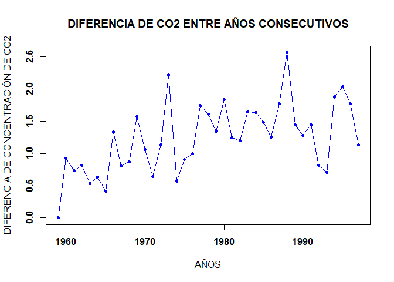

Tarea 1
================

# **TAREA 1**

**Integrantes**

-   BARRRENECHEA BENITES, Marycielo Corazon

-   BECERRA ZEVALLOS, Cesar Gerardo

-   MUÑOZ RIMACHI, Camilo Patricio

## **PARTE 1**

**1.** Calcula los valores numéricos aproximados de

**a.**

``` r
(0.3 * 0.15) / (0.3 * 0.15 + 0.2 * 0.8 + 0.5 * 0.12)
```

    ## [1] 0.1698113

**b.**

``` r
((5 ^ 6 )/(factorial(6)) ) *exp(-5)
```

    ## [1] 0.1462228

**c.**

``` r
(factorial(20)/(factorial(13)*factorial(7)))*0.4^7*0.6^13
```

    ## [1] 0.1658823

**2.** Realizar la siguiente suma

**a.** 1+2+3+…+1000

``` r
sum(seq(1:1000))
```

    ## [1] 500500

**b.** 1+2+4+8+16+…+1024

``` r
1+sum(2^seq(1:10))
```

    ## [1] 2047

**3.** El vector grupo representa el grupo al que pertenece una serie de
alumnos.

**a.** ¿Cuántos elementos tiene?

``` r
load("ei1012-1516-la-s1-datos.RData")
```

    ## Warning in readChar(con, 5L, useBytes = TRUE): cannot open compressed file
    ## 'ei1012-1516-la-s1-datos.RData', probable reason 'No such file or directory'

    ## Error in readChar(con, 5L, useBytes = TRUE): no se puede abrir la conexión

``` r
length(grupo)
```

    ## Error in eval(expr, envir, enclos): objeto 'grupo' no encontrado

**b.** ¿En qué posiciones del vector está la letra “A’’?

``` r
which(grupo=="A")
```

    ## Error in which(grupo == "A"): objeto 'grupo' no encontrado

**4.** El vector nota representa la nota de un examen de los alumnos que
están en los grupos del vector grupo.

**a.** ¿Cuánto suman todas las notas?

``` r
sum(nota)
```

    ## Error in eval(expr, envir, enclos): objeto 'nota' no encontrado

**b.** ¿Cuál es la media aritmética de todas las notas?

``` r
mean(nota)
```

    ## Error in mean(nota): objeto 'nota' no encontrado

**c.** ¿En qué posiciones están las notas mayores de 7.0?

``` r
which(nota>7)
```

    ## Error in which(nota > 7): objeto 'nota' no encontrado

**d.** Visualiza las notas ordenadas de mayor a menor

``` r
notasordenadas<-order(nota,na.last=TRUE,decreasing=TRUE)
```

    ## Error in order(nota, na.last = TRUE, decreasing = TRUE): objeto 'nota' no encontrado

``` r
nota[notasordenadas]
```

    ## Error in eval(expr, envir, enclos): objeto 'nota' no encontrado

OTRA MANERA:

``` r
rev(sort(nota))
```

    ## Error in sort(nota): objeto 'nota' no encontrado

**e.** ¿En qué posición está la nota máxima?

``` r
match(max(nota),nota)
```

    ## Error in match(max(nota), nota): objeto 'nota' no encontrado

``` r
head(notasordenadas,1)
```

    ## Error in head(notasordenadas, 1): objeto 'notasordenadas' no encontrado

**5.** A partir de los vectores grupo y nota definidos.

``` r
data.al=data.frame(grupo=c(grupo),nota=c(nota))
```

    ## Error in data.frame(grupo = c(grupo), nota = c(nota)): objeto 'grupo' no encontrado

**a.** Suma de notas 10 primeros alumnos

``` r
sum(nota[1:10])
```

    ## Error in eval(expr, envir, enclos): objeto 'nota' no encontrado

**b.** ¿Cuántos alumnos hay en el grupo C?

``` r
length(nota[grupo=='C'])
```

    ## Error in eval(expr, envir, enclos): objeto 'nota' no encontrado

**c.** ¿Cuántos alumnos han aprobado?

``` r
length(nota[nota>5])
```

    ## Error in eval(expr, envir, enclos): objeto 'nota' no encontrado

**d.** ¿Cuántos alumnos del grupo B han aprobado?

``` r
length(nota[grupo=='B'&nota>5])
```

    ## Error in eval(expr, envir, enclos): objeto 'nota' no encontrado

**e.** Porcentaje de alumnos del grupo C han aprobado

``` r
length(nota[grupo=='C'&nota>5])/length(nota[grupo=='C'])*100
```

    ## Error in eval(expr, envir, enclos): objeto 'nota' no encontrado

**f.** ¿De qué grupos son la máxima y mínima notas de toda la muestra?

MÁXIMA:

``` r
max(nota)
```

    ## Error in eval(expr, envir, enclos): objeto 'nota' no encontrado

``` r
data.al[data.al$nota==max(nota),]
```

    ## Error in eval(expr, envir, enclos): objeto 'data.al' no encontrado

MÍNIMA:

``` r
min(nota)
```

    ## Error in eval(expr, envir, enclos): objeto 'nota' no encontrado

``` r
data.al[data.al$nota==min(nota),]
```

    ## Error in eval(expr, envir, enclos): objeto 'data.al' no encontrado

**g.** Nota media de los alumnos de grupo A y B, juntos, considerando
sólo a los que han aprobado

``` r
mean(c(nota[grupo=='B'&nota>5],nota[grupo=='A'&nota>5]))
```

    ## Error in mean(c(nota[grupo == "B" & nota > 5], nota[grupo == "A" & nota > : objeto 'nota' no encontrado

**6.** Calcula el percentil 66 de las notas de todos los alumnos, y
también de los alumnos del grupo C

``` r
quantile(nota[notasordenadas],66/100)
```

    ## Error in quantile(nota[notasordenadas], 66/100): objeto 'nota' no encontrado

PARA LOS ALUMNOS DEL GRUPO C:

``` r
soloC <- data.al[(data.al$grupo == "C"),]
```

    ## Error in eval(expr, envir, enclos): objeto 'data.al' no encontrado

``` r
quantile(soloC$nota, 66/100)
```

    ## Error in quantile(soloC$nota, 66/100): objeto 'soloC' no encontrado

**7.** Un alumno tiene una nota de 4.9. ¿Qué porcentaje, del total de
alumnos, tiene una nota menor o igual que la suya? ¿Y qué porcentaje
tiene una nota mayor o igual que la suya?

MENOR:

``` r
length(nota[nota<=4.9])/length(nota)*100
```

    ## Error in eval(expr, envir, enclos): objeto 'nota' no encontrado

MAYOR:

``` r
length(nota[nota>=4.9])/length(nota)*100
```

    ## Error in eval(expr, envir, enclos): objeto 'nota' no encontrado

**8.** Realiza el gráfico de diagramas de caja de las notas de cada
grupo, para poder comparar el nivel de cada uno de ellos.

``` r
boxplot(nota~grupo)
```

    ## Error in eval(predvars, data, env): objeto 'nota' no encontrado

**9.** Si la variable conc recoge la concentración de plomo (en ppm) en
el aire de cierta zona durante un día completo

``` r
horas<-c(rep(0,12),gl(23,12))
minutos<-c(0,seq(5,55,5))
plomo<-data.frame(conc, horas,minutos)
```

    ## Error in data.frame(conc, horas, minutos): objeto 'conc' no encontrado

``` r
plomo
```

    ## Error in eval(expr, envir, enclos): objeto 'plomo' no encontrado

**a.** ¿Cuál ha sido la concentración máxima?

``` r
max(plomo$conc)
```

    ## Error in eval(expr, envir, enclos): objeto 'plomo' no encontrado

**b.** ¿En cuántos de los muestreos se ha superado la concentración de
40.0 ppm?

``` r
length(which(plomo$conc>40))
```

    ## Error in which(plomo$conc > 40): objeto 'plomo' no encontrado

**c.** ¿Cuál ha sido la concentración media del día?

``` r
mean(plomo$conc)
```

    ## Error in mean(plomo$conc): objeto 'plomo' no encontrado

**d.** ¿Cuáles fueron las 10 mediciones más bajas del día?

``` r
menoresconc<-order(plomo$conc,na.last = TRUE,decreasing = TRUE)
```

    ## Error in order(plomo$conc, na.last = TRUE, decreasing = TRUE): objeto 'plomo' no encontrado

``` r
plomo$conc[tail(menoresconc, 10)]
```

    ## Error in eval(expr, envir, enclos): objeto 'plomo' no encontrado

**e.** Si la primera medida fue a las 00:00. ¿A qué hora del día se
alcanzó la concentración máxima?

``` r
plomo[plomo$conc==max(conc),]
```

    ## Error in eval(expr, envir, enclos): objeto 'plomo' no encontrado

## **PARTE 2**

**1.** Graficar los puntos (1,1), (2,4), (3,6), (4,8), (5,25), (6,36),
(7,49), (8,61), (9,81) y (10,100) en un plano usado Rstudio

``` r
abscisas<-c(1,2,3,4,5,6,7,8,9,10)
ordenadas<-c(1,4,6,8,25,36,49,61,81,100)
plot(x=abscisas,y=ordenadas)
```

<!-- -->

**2.** Ingresar la matriz A en RStudio

``` r
A<-matrix(c(1, 2, 3, 4, 2, 4, 6, 8, 3, 6, 9, 12), nrow = 4, ncol = 3)
A
```

    ##      [,1] [,2] [,3]
    ## [1,]    1    2    3
    ## [2,]    2    4    6
    ## [3,]    3    6    9
    ## [4,]    4    8   12

**3.** Ingresar la matriz identidad de tamaño 3

``` r
I<-diag(3)
I
```

    ##      [,1] [,2] [,3]
    ## [1,]    1    0    0
    ## [2,]    0    1    0
    ## [3,]    0    0    1

**4.** Crea una función que cree una matriz nula ingresando las
dimensiones

``` r
matrixnula<-function(x,y) {
  matrix(0,x,y)
}
```

EJEMPLO:

``` r
matrixnula(7,10)
```

    ##      [,1] [,2] [,3] [,4] [,5] [,6] [,7] [,8] [,9] [,10]
    ## [1,]    0    0    0    0    0    0    0    0    0     0
    ## [2,]    0    0    0    0    0    0    0    0    0     0
    ## [3,]    0    0    0    0    0    0    0    0    0     0
    ## [4,]    0    0    0    0    0    0    0    0    0     0
    ## [5,]    0    0    0    0    0    0    0    0    0     0
    ## [6,]    0    0    0    0    0    0    0    0    0     0
    ## [7,]    0    0    0    0    0    0    0    0    0     0

**5.** Modificar la matriz diag(4), para que se parezca a la matriz B

``` r
B<-diag(c(0, 2, 3, 4), nrow = 4, ncol = 4)
B
```

    ##      [,1] [,2] [,3] [,4]
    ## [1,]    0    0    0    0
    ## [2,]    0    2    0    0
    ## [3,]    0    0    3    0
    ## [4,]    0    0    0    4

``` r
diag(c(0,2,3,4),4,4)
```

    ##      [,1] [,2] [,3] [,4]
    ## [1,]    0    0    0    0
    ## [2,]    0    2    0    0
    ## [3,]    0    0    3    0
    ## [4,]    0    0    0    4

**6.** Obtener la matriz transpuesta de A (ejercicio 2)

``` r
t(A)
```

    ##      [,1] [,2] [,3] [,4]
    ## [1,]    1    2    3    4
    ## [2,]    2    4    6    8
    ## [3,]    3    6    9   12

**7.** Realizar las siguientes operaciones A+B, A - B, 3B y AB

``` r
A
```

    ##      [,1] [,2] [,3]
    ## [1,]    1    2    3
    ## [2,]    2    4    6
    ## [3,]    3    6    9
    ## [4,]    4    8   12

``` r
B
```

    ##      [,1] [,2] [,3] [,4]
    ## [1,]    0    0    0    0
    ## [2,]    0    2    0    0
    ## [3,]    0    0    3    0
    ## [4,]    0    0    0    4

``` r
A+B
```

    ## Error in A + B: arreglos de dimensón no compatibles

``` r
A-B
```

    ## Error in A - B: arreglos de dimensón no compatibles

``` r
3*B
```

    ##      [,1] [,2] [,3] [,4]
    ## [1,]    0    0    0    0
    ## [2,]    0    6    0    0
    ## [3,]    0    0    9    0
    ## [4,]    0    0    0   12

``` r
A%*%B
```

    ## Error in A %*% B: argumentos no compatibles

``` r
B%*%A
```

    ##      [,1] [,2] [,3]
    ## [1,]    0    0    0
    ## [2,]    4    8   12
    ## [3,]    9   18   27
    ## [4,]   16   32   48

**8.** Crea una función para calcular P^6

``` r
P<-matrix(c(1,-2,1,2,4,0,3,-2,1),nrow=3,ncol=3)
P
```

    ##      [,1] [,2] [,3]
    ## [1,]    1    2    3
    ## [2,]   -2    4   -2
    ## [3,]    1    0    1

``` r
fun<- function(x){
  (((((x%*%x)%*%x)%*%x)%*%x)%*%x)
}
fun(P)
```

    ##       [,1]  [,2]  [,3]
    ## [1,] -1792    24 -2824
    ## [2,]  -464 -2416 -1344
    ## [3,]  -648   440  -912

**9.** Resolver el sistema de ecuaciones

3x−y+z=−1

9x−2y+z=−9

3x+y−2z=−9

``` r
C=cbind(c(3,9,3),c(-1,-2,1),c(1,1,-2))
D=c(-1,-9,-9)
solve(C,D)
```

    ## [1] -1  2  4

**10.** Utilizando la ayuda de R, investigue para qué sirven las
funciones eigen() y det()

det() sirve para hallar por separado el módulo del determinante de una
matriz

EJEMPLO:

``` r
mtrx=matrix(c(-2,2,-3,-1,1,3,2,0,-1),3,3)
det(mtrx)
```

    ## [1] 18

eigen() sirve para hallar por separado los valores y vectores propios de
una matriz

EJEMPLO:

``` r
eigen(mtrx)
```

    ## eigen() decomposition
    ## $values
    ## [1] -1.740446+3.020873i -1.740446-3.020873i  1.480893+0.000000i
    ## 
    ## $vectors
    ##                       [,1]                  [,2]         [,3]
    ## [1,] -0.0151632-0.5764302i -0.0151632+0.5764302i 0.1743727+0i
    ## [2,] -0.2043517+0.1954207i -0.2043517-0.1954207i 0.7252039+0i
    ## [3,]  0.7665177+0.0000000i  0.7665177+0.0000000i 0.6660882+0i

**11.** Considerando las matrices, calcular A⋅B-A(B^t)

Cambiamos a B⋅A-B(A^t)

``` r
v <- (1:10)
B2 <- matrix(c(v,v*2,v*3,v*4,v*5),10)
A2 <- matrix(c(0,1,0,0,1,1,0,1,1,0,0,1,0,0,1,1,0,1,0,1,0,1,0,1,0),5)
B2%*%A2 - B2%*%t(A2)
```

    ##       [,1] [,2] [,3] [,4] [,5]
    ##  [1,]    1   -1    1    2   -2
    ##  [2,]    2   -2    2    4   -4
    ##  [3,]    3   -3    3    6   -6
    ##  [4,]    4   -4    4    8   -8
    ##  [5,]    5   -5    5   10  -10
    ##  [6,]    6   -6    6   12  -12
    ##  [7,]    7   -7    7   14  -14
    ##  [8,]    8   -8    8   16  -16
    ##  [9,]    9   -9    9   18  -18
    ## [10,]   10  -10   10   20  -20

**12.** Considere β = (X^t⋅X) ^−1 ⋅ X^ t ⋅ Y

``` r
x<-matrix(c(1,1,1,1,1,1,-1,0,1,2),nrow=5,ncol=2)
y<-matrix(c(0,0,1,1,3),nrow = 5,ncol = 1)
(solve(t(x)%*%x)%*%t(x))%*%y
```

    ##           [,1]
    ## [1,] 0.5384615
    ## [2,] 0.7692308

**13** Corre el siguiente código para cargar los vectores year y co2 en
memoria

``` r
data(co2)
means = aggregate(co2, FUN=mean)
year = as.vector(time(means))
co2 = as.vector(means)
```

-   El vector CO2 contiene medidas de CO2 en la atmósfera, en unidades
    de ppm, durante el periodo 1959-1997. El vector year contiene sus
    años correspondientes.

``` r
co2
```

    ##  [1] 315.8258 316.7475 317.4850 318.2975 318.8325 319.4625 319.8725 321.2100
    ##  [9] 322.0200 322.8900 324.4592 325.5175 326.1550 327.2933 329.5117 330.0792
    ## [17] 330.9858 331.9858 333.7300 335.3358 336.6808 338.5150 339.7608 340.9592
    ## [25] 342.6083 344.2467 345.7258 346.9750 348.7508 351.3133 352.7542 354.0367
    ## [33] 355.4783 356.2917 356.9958 358.8800 360.9142 362.6867 363.8175

``` r
year
```

    ##  [1] 1959 1960 1961 1962 1963 1964 1965 1966 1967 1968 1969 1970 1971 1972 1973
    ## [16] 1974 1975 1976 1977 1978 1979 1980 1981 1982 1983 1984 1985 1986 1987 1988
    ## [31] 1989 1990 1991 1992 1993 1994 1995 1996 1997

-   Calcular un vector de diferencias de CO2 entre años consecutivos,
    que sería:
    -   CO2 en 1960 menos CO2 en 1959
    -   CO2 en 1961 menos CO2 en 1960
    -   y así sucesivamente…

``` r
diff(co2)
```

    ##  [1] 0.9216667 0.7375000 0.8125000 0.5350000 0.6300000 0.4100000 1.3375000
    ##  [8] 0.8100000 0.8700000 1.5691667 1.0583333 0.6375000 1.1383333 2.2183333
    ## [15] 0.5675000 0.9066667 1.0000000 1.7441667 1.6058333 1.3450000 1.8341667
    ## [22] 1.2458333 1.1983333 1.6491667 1.6383333 1.4791667 1.2491667 1.7758333
    ## [29] 2.5625000 1.4408333 1.2825000 1.4416667 0.8133333 0.7041667 1.8841667
    ## [36] 2.0341667 1.7725000 1.1308333

``` r
m<-c(0,diff(co2))
```

-   Crear un **plot** con lineas y puntos mostrando las diferencias
    consecutivas de CO2 en función del tiempo (1960, 1961, etc…), en
    **negrita**.

``` r
plot(year,m,type="o",pch=20,xlab="AÑOS",ylab="DIFERENCIA DE CONCENTRACIÓN DE CO2",main="DIFERENCIA DE CO2 ENTRE AÑOS CONSECUTIVOS",col="blue",font=2)
```

<!-- -->

-   La diferencia de concentración de CO2 entre 2020 y 2019 fue igual a
    2.64. Agregar un punto rojo representando esa diferencia al plot ya
    creado (usar una forma diferente, como pch=4).

``` r
plot(year,m,xlim=c(1959,2020),type="o",pch=20,xlab="AÑOS",ylab="DIFERENCIA DE CONCENTRACIÓN DE CO2",main="DIFERENCIA DE CO2 ENTRE AÑOS CONSECUTIVOS",col="blue",font=2)
points(2020,2.64,pch=4,col="red")
```

<!-- -->

**14.** Lee el archivo rainfall.csv como un data.frame. Calcula e
imprime un vector con los nombres de las estaciones donde al menos uno
de los meses tiene una precipitación superior a 180mm

``` r
df<-read.csv("C:/Users/Camilo/Documents/UNMSM/PROGRAMACIÓN/rainfall.csv")
Nombres<-df[(df$sep>180)|(df$oct>180)|(df$nov>180)|(df$dec>180)|(df$jan>180)|(df$feb>180)|(df$mar>180)|(df$apr>180)|(df$may>180),]
c((Nombres$name))
```

    ## [1] "Golan Farm" "Eilon"      "Fasutta"    "Yehiam"     "Kfar Mahol"
    ## [6] "Meron"      "Horashim"
