# **TAREA 4 - GRUPO 13**

**Integrantes**

-   BARRRENECHEA BENITES, Marycielo Corazon

-   BECERRA ZEVALLOS, Cesar Gerardo

-   MUÑOZ RIMACHI, Camilo Patricio

<!-- -->

    library(ggplot2)

    ## Warning: package 'ggplot2' was built under R version 4.1.2

    library(datos)

    ## Warning: package 'datos' was built under R version 4.1.2

    millas

    ## # A tibble: 234 x 11
    ##    fabricante modelo     cilindrada  anio cilindros transmision traccion ciudad
    ##    <chr>      <chr>           <dbl> <int>     <int> <chr>       <chr>     <int>
    ##  1 audi       a4                1.8  1999         4 auto(l5)    d            18
    ##  2 audi       a4                1.8  1999         4 manual(m5)  d            21
    ##  3 audi       a4                2    2008         4 manual(m6)  d            20
    ##  4 audi       a4                2    2008         4 auto(av)    d            21
    ##  5 audi       a4                2.8  1999         6 auto(l5)    d            16
    ##  6 audi       a4                2.8  1999         6 manual(m5)  d            18
    ##  7 audi       a4                3.1  2008         6 auto(av)    d            18
    ##  8 audi       a4 quattro        1.8  1999         4 manual(m5)  4            18
    ##  9 audi       a4 quattro        1.8  1999         4 auto(l5)    4            16
    ## 10 audi       a4 quattro        2    2008         4 manual(m6)  4            20
    ## # ... with 224 more rows, and 3 more variables: autopista <int>,
    ## #   combustible <chr>, clase <chr>

## **PARTE 1: ggplot base**

**1.** Ejecuta ggplot(data = millas). ¿Qué observas?

    ggplot(data=millas)

No se observa ningún gráfico en el output.

**2.** ¿Cuántas filas hay en millas? ¿Cuántas columnas?

    #Núm. de filas:
    dplyr::count(millas)

    ## # A tibble: 1 x 1
    ##       n
    ##   <int>
    ## 1   234

    #Núm de columnas:
    length(millas)

    ## [1] 11

**3.** ¿Qué describe la variable traccion? Lee la ayuda de ?millas para
encontrar la respuesta.

    ?millas

    ## starting httpd help server ... done

La variable tracción refiere al esfuerzo interno al que está sometido el
auto por la aplicación de dos fuerzas opuestas. Esta puede ser delantera
(d), trasera (t) o en las cuatro ruedas (4).

**4.** Realiza un gráfico de dispersión de autopista versus cilindros.

    ggplot(data=millas)+
      geom_point(aes(autopista, cilindros))

**5.** ¿Qué sucede cuando haces un gráfico de dispersión (scatterplot)
de clase versus traccion? ¿Por qué no es útil este gráfico?

    ggplot(data=millas)+
      geom_point(aes(autopista, traccion))

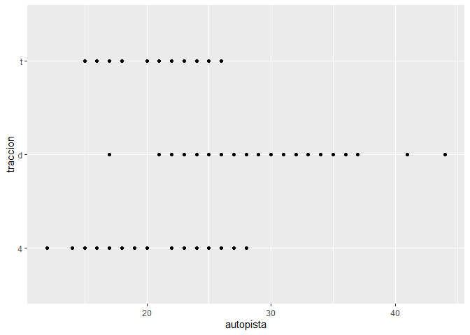

No es útil puesto que la tracción no es una variable numérica continua,
por ende, no se representará bien en un gráfico de dispersión que hace
uso de los ejes coordenados.

## **PARTE 2: mapeo estético**

**1.** ¿Qué no va bien en este código? ¿Por qué hay puntos que no son
azules?

     ggplot(data = millas) +
       geom_point(mapping = aes(x = cilindrada, y = autopista, color = "blue"))

El error consiste en que el color no se visualiza como azul, sino, lo
toma como si fuese información sobre una variable. El color = “blue”
debe colocarse fuera de la aestética.

    ggplot(data = millas) +
     geom_point(mapping = aes(x = cilindrada, y = autopista), color = "blue")

**2.** ¿Qué variables en millas son categóricas? ¿Qué variables son
continuas? (Pista: escribe ?millas para leer la documentación de ayuda
para este conjunto de datos). ¿Cómo puedes ver esta información cuando
ejecutas millas?

    ?millas

Las variables categóricas son “fabricante”, “modelo”, “transmiión”,
“tracción,”combustible” y “clase”. La única variable continua es
cilindrada

**3.** Asigna una variable continua a color, size, y shape. ¿Cómo se
comportan estas estéticas de manera diferente para variables categóricas
y variables continuas?

-   Color

Con una variable categórica (traccion), se forma una leyenda de color
con cada uno de los valores que toma la variable.

    ggplot(data = millas) + geom_point(mapping = aes(x = cilindrada, y = autopista, color = traccion))

Con una variable continua (año), se forma una leyenda de gradiente de
color (de claro a oscuro) para los datos que puede tomar.

    ggplot(data = millas) +
     geom_point(mapping = aes(x = cilindrada, y = autopista, color = anio))

-   Size

Con una variable categórica (traccion), se forma una leyenda de tamaños
con cada uno de los valores que toma la variable.

    ggplot(data = millas) +
     geom_point(mapping = aes(x = cilindrada, y = autopista, size = traccion))

    ## Warning: Using size for a discrete variable is not advised.

Con una variable continua (año), se forma una leyenda de tamaños con
cada uno de los valores que toma la variable ordenados de mayor tamaño
con el mayor valor y menor tamaño con el menor valor.

    ggplot(data = millas) +
     geom_point(mapping = aes(x = cilindrada, y = autopista, size = anio))

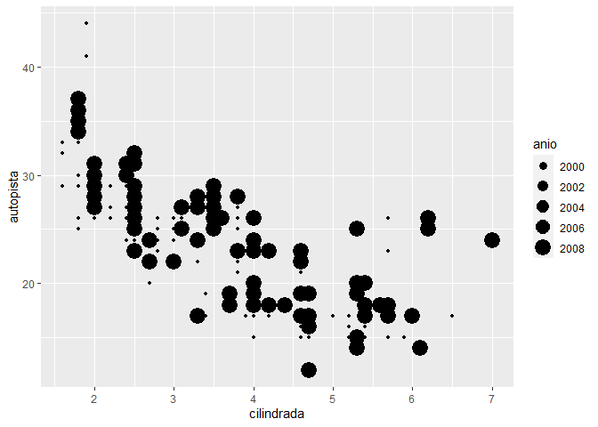

-   Shape

Con una variable categórica (traccion), se forma una leyenda de formas
con cada uno de los valores que toma la variable.

    ggplot(data = millas) +
     geom_point(mapping = aes(x = cilindrada, y = autopista, shape=traccion))

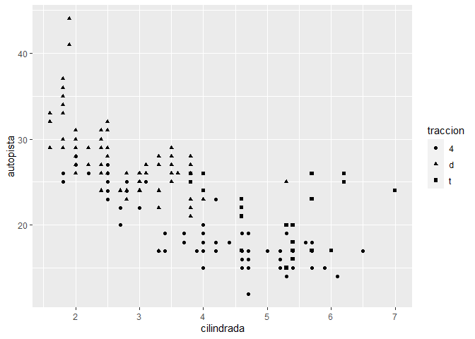

Con una variable continua (año), no se puede plotear.

    ggplot(data = millas) +
     geom_point(mapping = aes(x = cilindrada, y = autopista, shape=anio))

    ## Error: A continuous variable can not be mapped to shape

**4.** ¿Qué ocurre si asignas o mapeas la misma variable a múltiples
estéticas?

    ggplot(data = millas) +
     geom_point(mapping = aes(x = fabricante, y = fabricante, color=fabricante, size=fabricante))

    ## Warning: Using size for a discrete variable is not advised.

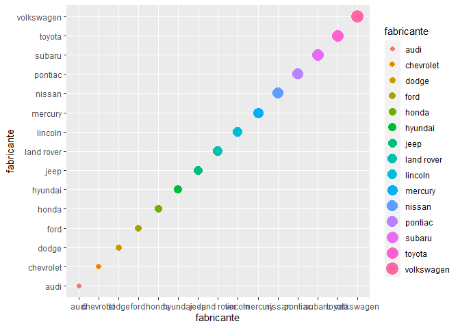

Crea un diagrama con puntos que, si se unen, forman la función
identidad. Para las estéticas shape, color y size, también crea una
leyenda como se mencionó anteriormente.

**5.** ¿Qué hace la estética stroke? ¿Con qué formas trabaja? (Pista:
consulta ?geom\_point)

    ?geom_point
    ggplot() +
      geom_point(data = millas, mapping = aes(x = cilindrada, y = autopista, color=traccion, stroke=3),shape=4)

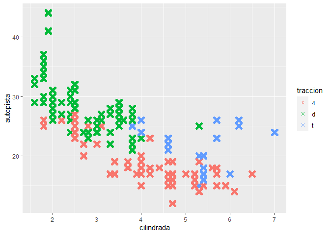

Stroke se encarga de agrandar o disminuir el grosor del borde del punto

**6.** ¿Qué ocurre si se asigna o mapea una estética a algo diferente
del nombre de una variable, como aes(color = cilindrada &lt; 5)?

     ggplot(data = millas) +
       geom_point(mapping = aes(x = cilindrada, y = autopista, color = cilindrada < 5))

En este ejemplo, se asignó en la estética, el color como “cilindrada
&lt; 5” el cual es una proposición lógica. Entonces, la leyenda crea dos
colores, uno si es verdadero (TRUE) o si es falso (FALSE).

## **PARTE 3: facetas**

**1.** ¿Qué ocurre si intentas separar en facetas una variable continua?

    ggplot(data = millas) +
      geom_point(mapping = aes(x = cilindrada, y = autopista)) +
      facet_wrap(~ autopista)

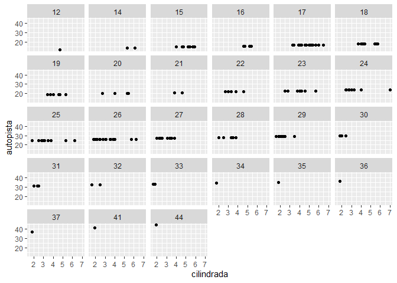

En este ejemplo podemos ver las que las facetas son como gráficos
individuales para cada subconjunto creado de datos que se dividen en el
valor que puede tomar esta misma variable.

**2.** ¿Qué significan las celdas vacías que aparecen en el gráfico
generado usando facet\_grid(traccion ~ cilindros)? ¿Cómo se relacionan
con este gráfico?

    ggplot(data = millas) +
      geom_point(mapping = aes(x = traccion, y = cilindros))

    ggplot(data = millas) +
      geom_point(mapping = aes(x = traccion, y = cilindros)) +
      facet_grid(traccion ~ cilindros)

Se forman subgráficos o facetas que se van a separar por cada una de las
combinaciones de ambas variables (que no se cumplen siempre y muestran
gráficos vacíos). En el gráfico de dato, no existen otras variables que
condicionen la distribución de los datos en la tabla como si sucede
agregando las facetas.

**3.** ¿Qué grafica el siguiente código? ¿Qué hace . ? categóricas y
variables continuas?

    ggplot(data = millas) +
      geom_point(mapping = aes(x = cilindrada, y = autopista)) +
      facet_grid(traccion ~ .)

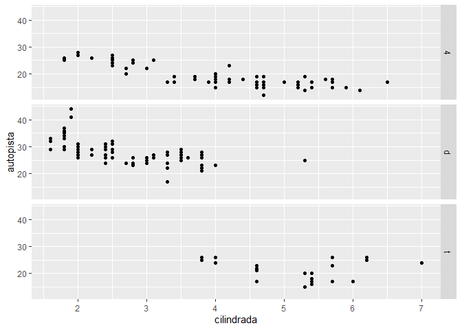

    ggplot(data = millas) +
      geom_point(mapping = aes(x = cilindrada, y = autopista)) +
      facet_grid(. ~ cilindros)

El punto sirve para colocarlo en lugar de una variable lo cual permitiá
que no se separe en facetas ya sea las columnas (variable categórica) o
en filas (variable discreta).

**4.** Mira de nuevo el primer gráfico en facetas presentado en esta
sección:

    ggplot(data = millas) +
      geom_point(mapping = aes(x = cilindrada, y = autopista)) +
      facet_wrap(~ clase, nrow = 2)

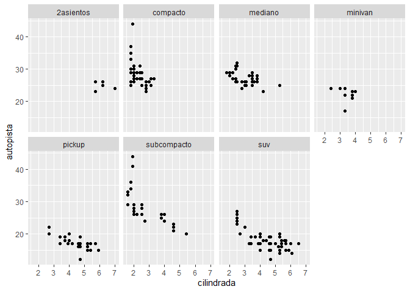

-   ¿Cuáles son las ventajas de separar en facetas en lugar de aplicar
    una estética de color? ¿Cuáles son las desventajas?

VENTAJA: Con las facetas, se ven gráficos divididos en subconjuntos vez
de un solo gráfico con datos de color.

DESVENTAJA: dependiendo de la cantidad de valores que puede tomar una
variable, se pueden generar demasiadas facetas y que estas sean aún más
trabajosas de analizar que los datos juntos.

-   ¿Cómo cambiaría este balance si tuvieras un conjunto de datos más
    grande? Lee ?facet\_wrap. ¿Qué hace nrow? ¿Qué hace ncol? ¿Qué otras
    opciones controlan el diseño de los paneles individuales? ¿Por qué
    facet\_grid() no tiene argumentos nrow y ncol?

<!-- -->

    ?facet_wrap
    ggplot(data = millas) +
      geom_point(mapping = aes(x = cilindrada, y = autopista)) +
      facet_wrap(~ clase, nrow = 2, ncol=5)

Los argumentos “nrow” y “ncol” indican cuántas filas y cuántas columnas
se desean en la gráfica, respectivamente (en el caso de indicar ambas,
el producto de estas debe ser mayor que la cantidad de facetas). En el
caso de facet\_grid() se usan los argumentos “rows” y “cols”, los cuales
son un conjunto de variables como grupos para las facetas.

-   Cuando usas facet\_grid(), generalmente deberías poner la variable
    con un mayor número de niveles únicos en las columnas. ¿Por qué?

<!-- -->

    ggplot(data = millas) +
      geom_point(mapping = aes(x = traccion, y = clase)) +
      facet_grid(clase~traccion)

    ggplot(data = millas) +
      geom_point(mapping = aes(x = traccion, y = clase)) +
      facet_grid(traccion~clase)

En este ejemplo, se observa que es conveniente colocar la variable con
más niveles o subdatos en las columnas, con el objetivo de obtener
gráficos más grandes y más claros.

## **PARTE 4: objetos geométricos**

**1.** ¿Qué geom usarías para generar un gráfico de líneas? ¿Y para un
diagrama de caja? ¿Y para un histograma? ¿Y para un gráfico de área??

Para un diagrama de línea: geom\_line()

    ggplot(data=millas)+
      geom_line(aes(cilindrada, autopista))

Para un diagrama de cajas: geom\_boxplot()

    ggplot(data=millas)+
      geom_boxplot(aes(clase, cilindrada))

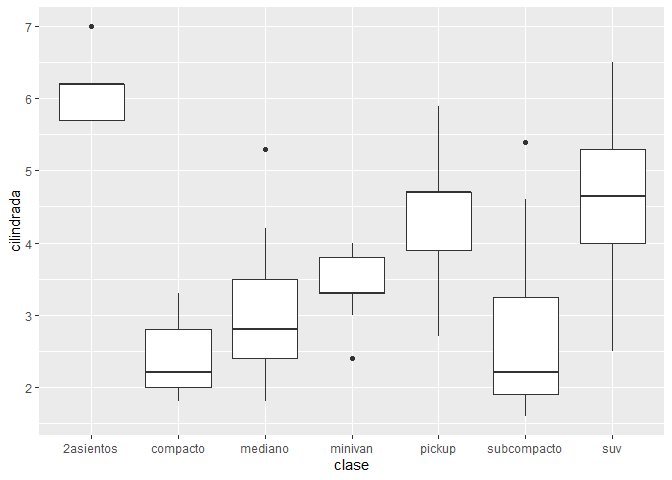

Para un histograma: geom\_histogram()

    ggplot(data=millas)+
      geom_histogram(aes(cilindrada))

    ## `stat_bin()` using `bins = 30`. Pick better value with `binwidth`.

Para un área: geom\_area()

    ggplot(data=millas)+
      geom_area(aes(autopista, cilindrada))

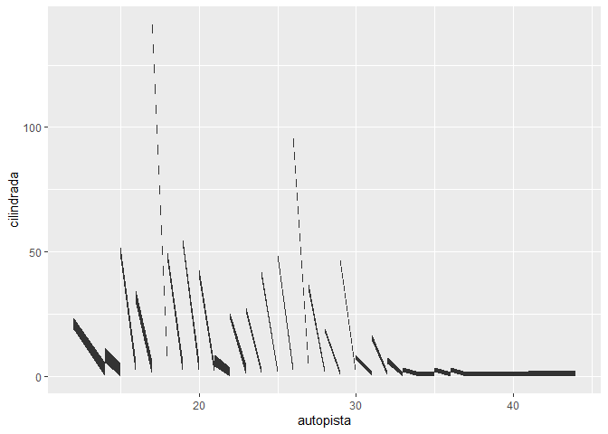

**2.** Ejecuta este código en tu mente y predice cómo se verá el output.
Luego, ejecuta el código en R y verifica tus predicciones.

    ggplot(data = millas, mapping = aes(x = cilindrada, y = autopista, color = traccion)) +
      geom_point() +
      geom_smooth(se = FALSE)

    ## `geom_smooth()` using method = 'loess' and formula 'y ~ x'

Es probable que este código genere un gráfico de dispersión entre las
variables cilindrada y autopista, donde los puntos tienen un determinado
color de acuerdo a la variable tracción. Además el gráfico tendrá un
suavizado o smooth, generado por la desviación estándar.

**3.** ¿Qué muestra show.legend = FALSE? ¿Qué pasa si lo quitas? ¿Por
qué crees que lo utilizamos antes en el capítulo?

Como su mismo nombre lo dice, si colocamos show.legend = FALSE,ya no se
visualizará la leyenda en el gráfico. Si se quita, entonces la función
asumirá show.legen = TRUE por defecto y mostrará la leyenda.

    ggplot(data=millas)+
      geom_point(aes(cilindrada, autopista, color=traccion), show.legend=FALSE)

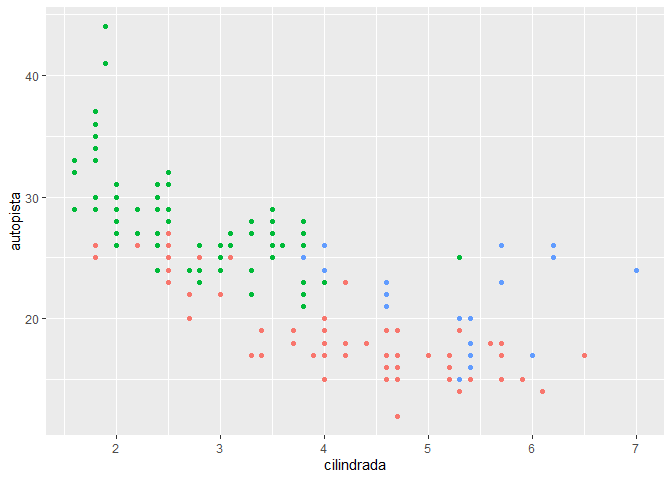

**4.** ¿Qué hace el argumento se en geom\_smooth()?

Es un argumento que, al darle el valor de TRUE, genera un suavizado o
smooth al gráfico que tenemos. Este suavizado consiste en una cantidad
de desviaciones estándar como un intervalo en el que estarán la mayor
parte de los datos.

    ggplot(data = millas, mapping = aes(x = cilindrada, y = autopista, color = traccion)) +
      geom_point() +
      geom_smooth(se = TRUE)

    ## `geom_smooth()` using method = 'loess' and formula 'y ~ x'

**5.** ¿Se verán distintos estos gráficos? ¿Por qué sí o por qué no?

    ggplot(data = millas, mapping = aes(x = cilindrada, y = autopista)) +
      geom_point() +
      geom_smooth()

    ## `geom_smooth()` using method = 'loess' and formula 'y ~ x'

    ggplot() +
      geom_point(data = millas, mapping = aes(x = cilindrada, y = autopista)) +
      geom_smooth(data = millas, mapping = aes(x = cilindrada, y = autopista))

    ## `geom_smooth()` using method = 'loess' and formula 'y ~ x'

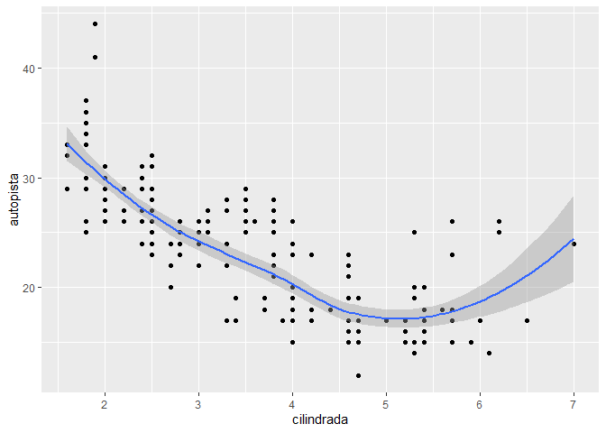

No se verán distintos, porque en la primera función la data se coloca en
ggplot() y en la segunda se coloca la misma data, solo que en las
funciones de geom\_point y geom\_smooth. Concluimos, entonces, que el
orden en que se coloquen los datos no afecta el gráfico.

**6.** Recrea el código R necesario para generar los siguientes
gráficos:

    ggplot() +
      geom_point(data = millas, mapping = aes(x = cilindrada, y = autopista), size=6, shape=20) +
      geom_smooth(data = millas, mapping = aes(x = cilindrada, y = autopista), se=FALSE)

    ## `geom_smooth()` using method = 'loess' and formula 'y ~ x'

    ggplot() +
      geom_point(data = millas, mapping = aes(x = cilindrada, y = autopista, group=traccion), size=6, shape=20) +
      geom_smooth(data = millas, mapping = aes(x = cilindrada, y = autopista, group=traccion), size=2, se=FALSE)

    ## `geom_smooth()` using method = 'loess' and formula 'y ~ x'

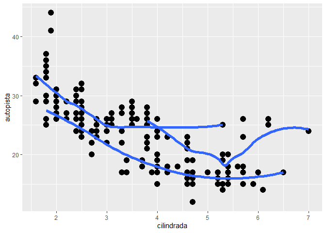

    ggplot() +
      geom_point(data = millas, mapping = aes(x = cilindrada, y = autopista, color=traccion), size=6, shape=20) +
      geom_smooth(data = millas, mapping = aes(x = cilindrada, y = autopista, color=traccion), size=2, se=FALSE)

    ## `geom_smooth()` using method = 'loess' and formula 'y ~ x'

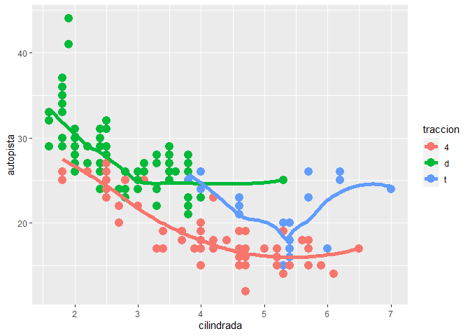

    ggplot() +
      geom_point(data = millas, mapping = aes(x = cilindrada, y = autopista, color=traccion), size=6, shape=20) +
      geom_smooth(data = millas, mapping = aes(x = cilindrada, y = autopista), size=2, se=FALSE)

    ## `geom_smooth()` using method = 'loess' and formula 'y ~ x'

    ggplot() +
      geom_point(data = millas, mapping = aes(x = cilindrada, y = autopista, color=traccion), size=6, shape=20) +
      geom_smooth(data = millas, mapping = aes(x = cilindrada, y = autopista, linetype=traccion), size=2, se=FALSE)

    ## `geom_smooth()` using method = 'loess' and formula 'y ~ x'

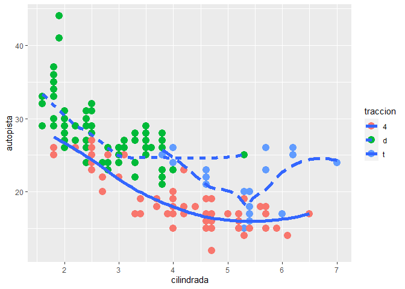

    ggplot() +
      geom_point(data = millas, mapping = aes(x = cilindrada, y = autopista), colour="white", size=12, shape=20) +
      geom_point(data = millas, mapping = aes(x = cilindrada, y = autopista, color=traccion), size=6, shape=20)

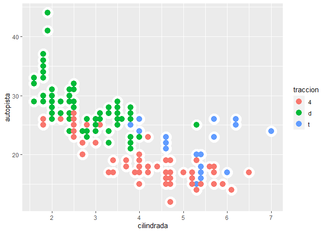

## **PARTE 5: gráficos estadísticos**

**1.** ¿Cuál es el geom predeterminado asociado con stat\_summary()?
¿Cómo podrías reescribir el gráfico anterior para usar esa función geom
en lugar de la función stat?

Gráfico anterior:

    ggplot(data = diamantes) +
      stat_summary(mapping = aes(x = corte, y = profundidad), fun.min = min, fun.max = max, fun = median)

stat\_sumary resume los valores de la variable dependiente para cada
valor de la independiente, con lo que se resalta el resumen que se está
computando. Usando una función de geometría sería:

    ggplot(data = diamantes) +
      geom_pointrange(mapping = aes(x = corte, y = profundidad), stat = "summary", fun.min = min, fun.max = max, fun = median)

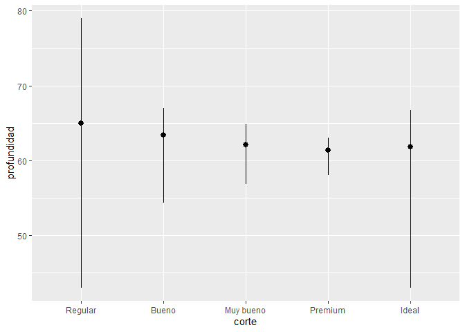

**2.** ¿Qué hace geom\_col()? ¿En qué se diferencia de geom\_bar()?

geom\_col requiere tanto una variable dependiente e independiente y
forma columnas que alcanzan el valor de la dependiente.

    ggplot()+geom_col(data=millas, aes(x=autopista, y=cilindrada))

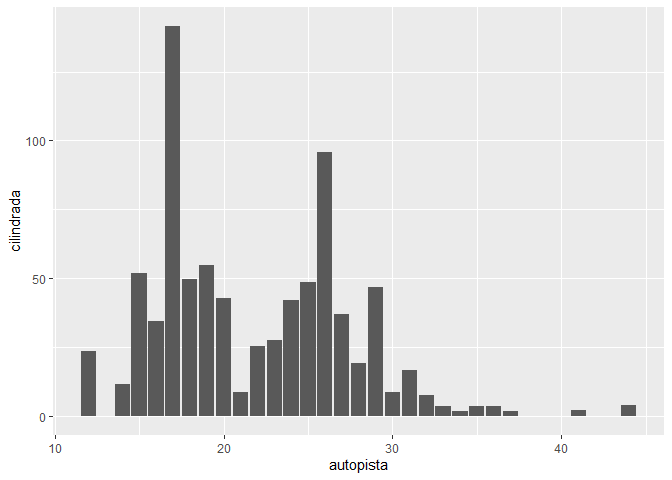

geom\_bar solo requiere una variable independiente y forma barras que
cuentan cuántos datos hay con cada valor distinto

    ggplot()+geom_bar(data=millas, aes(x=traccion))

**3.** La mayoría de los geoms y las transformaciones estadísticas
vienen en pares que casi siempre se usan en conjunto. Lee la
documentación y haz una lista de todos los pares. ¿Qué tienen en común?

    objetos <- getNamespaceExports("ggplot2")
    geoms <- objetos[grepl("geom_", objetos)]
    stats <- objetos[grepl("stat_", objetos)]
    geoms_filtrados <- sort(geoms[geoms %in% paste0("geom_", gsub("stat_", "", stats))])
    stats_filtrados <- paste0("stat_", gsub("geom_", "", geoms_filtrados))
    pares <- tibble::tibble(geoms = geoms_filtrados,
                            stats = stats_filtrados)
    pares

    ## # A tibble: 18 x 2
    ##    geoms                  stats                 
    ##    <chr>                  <chr>                 
    ##  1 geom_bin_2d            stat_bin_2d           
    ##  2 geom_bin2d             stat_bin2d            
    ##  3 geom_boxplot           stat_boxplot          
    ##  4 geom_contour           stat_contour          
    ##  5 geom_contour_filled    stat_contour_filled   
    ##  6 geom_count             stat_count            
    ##  7 geom_density           stat_density          
    ##  8 geom_density_2d        stat_density_2d       
    ##  9 geom_density_2d_filled stat_density_2d_filled
    ## 10 geom_density2d         stat_density2d        
    ## 11 geom_density2d_filled  stat_density2d_filled 
    ## 12 geom_function          stat_function         
    ## 13 geom_qq                stat_qq               
    ## 14 geom_qq_line           stat_qq_line          
    ## 15 geom_quantile          stat_quantile         
    ## 16 geom_sf                stat_sf               
    ## 17 geom_smooth            stat_smooth           
    ## 18 geom_spoke             stat_spoke

**4.** ¿Qué variables calcula stat\_smooth()? ¿Qué parámetros controlan
su comportamiento?

    ggplot()+stat_smooth(data=millas, aes(x=autopista, y=cilindrada))

    ## `geom_smooth()` using method = 'loess' and formula 'y ~ x'

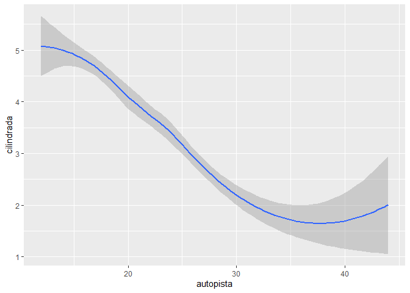

stat\_smooth calcula la gráfica de la función como una línea y toma en
cuenta la desviación estándar como un suavizado (intervalo de
confianza). Por lo que calcula el error estándar y el intervalo superior
e inferior de confianza. Entre sus parámetros que lo controlan, requiere
de ambas variables x y, un método para el suavizado (“lm”, “glm”, “gam”,
“loess”), el parámetro “se” que determina si se plotea o no el error
estándar y el parámetro na.rm que determina si se eliminan los valores
NA.

**5.** En nuestro gráfico de barras de proporción necesitamos establecer
group = 1. ¿Por qué? En otras palabras, ¿cuál es el problema con estos
dos gráficos?

Gráficos:

    ggplot(data = diamantes) +
      geom_bar(mapping = aes(x = corte, y = ..prop..))

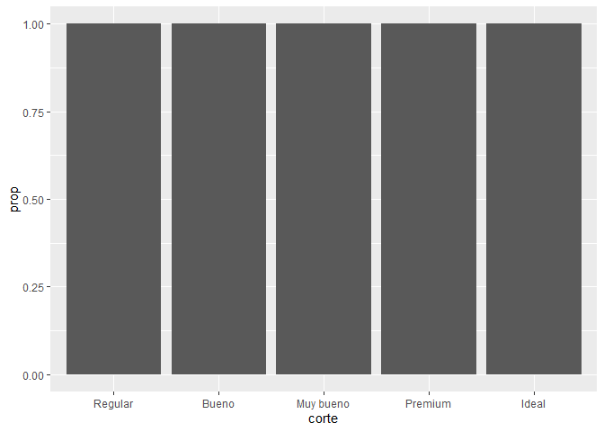

    ggplot(data = diamantes) +
      geom_bar(mapping = aes(x = corte, fill = color, y = ..prop..))

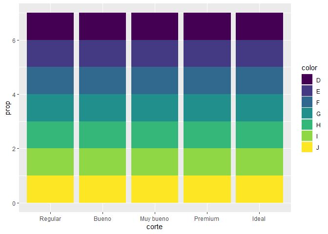

En los dos gráficos referidos, no se coloca group=1 y se observa que
todas las barras tienen la misma longitud.

    ggplot() +
      geom_bar(data = diamantes, mapping = aes(x = corte, y = ..prop.., group = 1))

Cuando se coloca el group=1 se observa que ahora las barras tienen un
tamaño proporcional para con todos los grupos.

Para el segundo caso, como se requiere separar por color, entonces
necesitaremos normalizar las barras:

    ggplot() +
      geom_bar(data = diamantes, mapping = aes(x = corte, fill = color, y = ..count.. / sum(..count..)))

## **PARTE 6: ajustes de posición**

**1.** ¿Cuál es el problema con este gráfico? ¿Cómo podrías mejorarlo?

    ggplot(data = millas, mapping = aes(x = ciudad, y = autopista))+geom_point()

Observamos que hay puntos que se están superponiendo, entonces podríamos
hacer un ajuste con el argumento position = “jitter” para añadirle un
ruido o variación a los puntos para que se dispersen.

    ggplot(data = millas, mapping = aes(x = ciudad, y = autopista))+geom_point(position = "jitter")

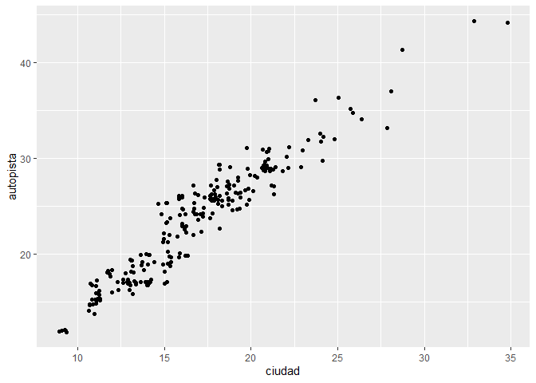

**2.** ¿Qué parámetros de geom\_jitter() controlan la cantidad de ruido?

Lo controlan los argumentos de width y height que son los que indican
cuánto habrá de ruido en horitzontal y vertical, respectivamente.
Mientras mayor sean estos valores, habrá mayor dispersión de puntos.

    ggplot(data = millas, mapping = aes(x = ciudad, y = autopista))+geom_jitter(width=20, height = 10)

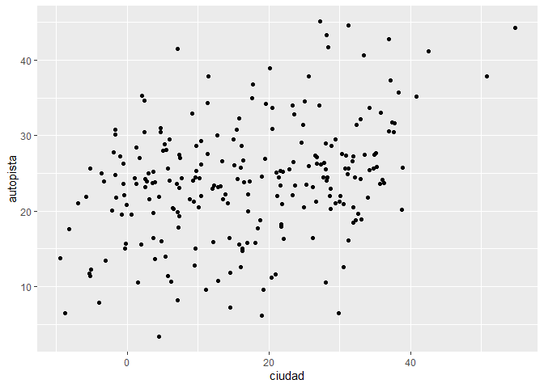

**3.** Compara y contrasta geom\_jitter() con geom\_count()

    ggplot(data = millas, mapping = aes(x = ciudad, y = autopista))+geom_jitter()

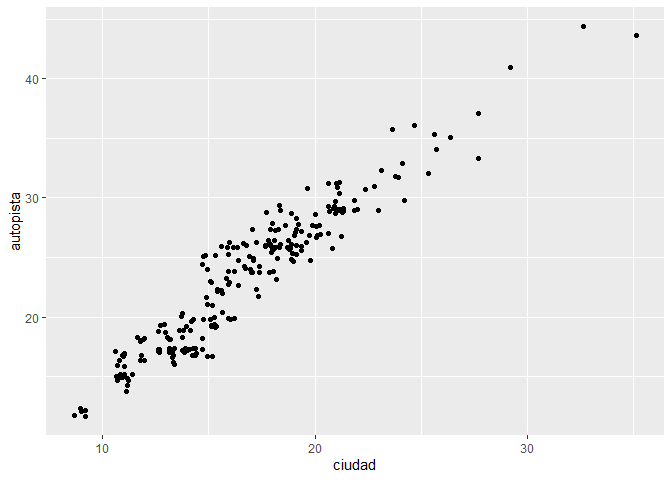

    ggplot(data = millas, mapping = aes(x = ciudad, y = autopista))+geom_count()

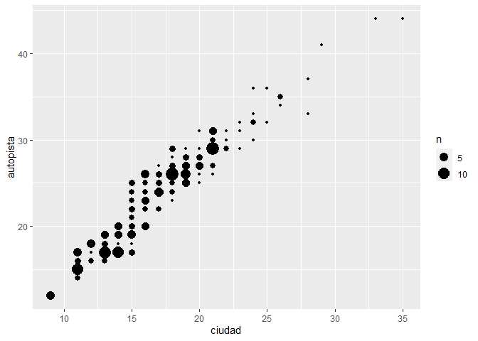

La diferencia radica en que geom\_count() cuenta el número de puntos que
se encuentran en una coordenada en específico, por ende, engruesa más
las zonas donde hay más datos. A diferneica, geom\_jitter se encarga de
aumentar la dispersión entre los puntos mediante un ruido aleatorio.

**4.** ¿Cuál es el ajuste de posición predeterminado de geom\_boxplot()?
Crea una visualización del conjunto de datos de millas que lo demuestre.

    ggplot(data = millas, mapping = aes(x = ciudad, y = autopista, color=traccion))+geom_boxplot(position = "identity")

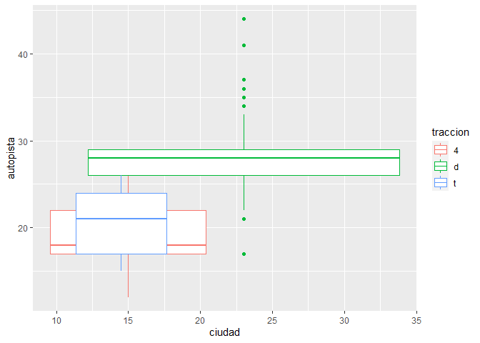

En el caso del geom\_boxplot, el ajuste de posición específico es el
position = “identity” el cual permite que los boxplots se vean
superpuestos en un mismo gráfico, en vex de en líneas separadas.

## **PARTE 7: sistema de coordenadas**

**1.** Convierte un gráfico de barras apiladas en un gráfico circular
usando coord\_polar().

    ggplot(millas, aes(x = traccion, fill = combustible)) +
      geom_bar()

    ggplot(millas, aes(x = traccion, fill = combustible)) +
      geom_bar(width = 1) +
      coord_polar(theta = "x")

**2.** ¿Qué hace labs()? Lee la documentación.

    ?labs
    ggplot(millas, aes(x = traccion, fill = combustible)) +
      geom_bar() + 
      labs(x="Tipo de tracción", y="Cantidad", title="Gráfico de barras combustible vs tracción", subtitle="Grupo 13")

La función labs() es la encargada de generar títulos, subtítulos y
etiquetas en los ejes para los gráficos de ggplot

**3.** ¿Cuál es la diferencia entre coord\_quickmap() y coord\_map()?

    ?coord_quickmap
    ?coord_map

La función coord\_map() plotea una porción de la Tierra en un plano
usando proyecciones cartográficas (que tienen cierta deformación) y
puede demorar en cargar. La función coord\_quickmap() acelera el proceso
de carga pues trabaja con una aproximación de proyecciones que funciona
mejor en áreas pequeñas de baja latitud.

    usa <- map_data("usa")
    ggplot(usa, aes(x=long, y=lat, group=group))+geom_polygon(fill="gray", color="black")+coord_map()

    usa <- map_data("usa")
    ggplot(usa, aes(x=long, y=lat, group=group))+geom_polygon(fill="gray", color="black")+coord_quickmap()

**4.** ¿Qué te dice la gráfica siguiente sobre la relación entre ciudad
y autopista? ¿Por qué es coord\_fixed() importante? ¿Qué hace
geom\_abline()?

    ggplot(data = millas, mapping = aes(x = ciudad, y = autopista)) +
      geom_point() +
      geom_abline() +
      coord_fixed()

La gráfica evidencia que las variables ciudad y autopista están en
relación directamente proporcional. La función coord\_fixed() se encarga
de arreglar la escala de las coordenadas (mediciones iguales tanto para
x como para y) lo que en este caso genera que el plot se alargue en el
eje y. La función geom\_abline() se encarga de crear líneas de
referencia en este caos genera una línea paralela a la distribución de
los datos.
